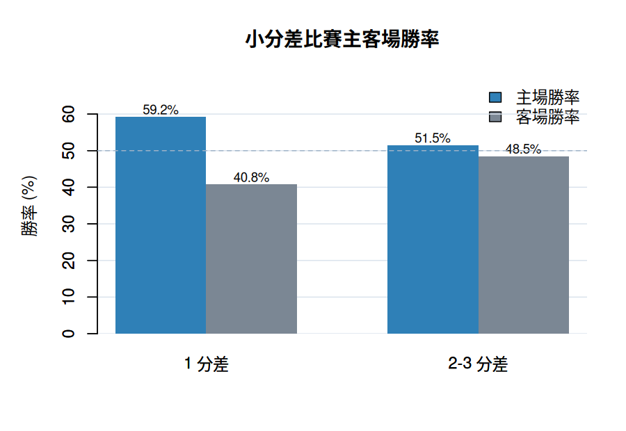
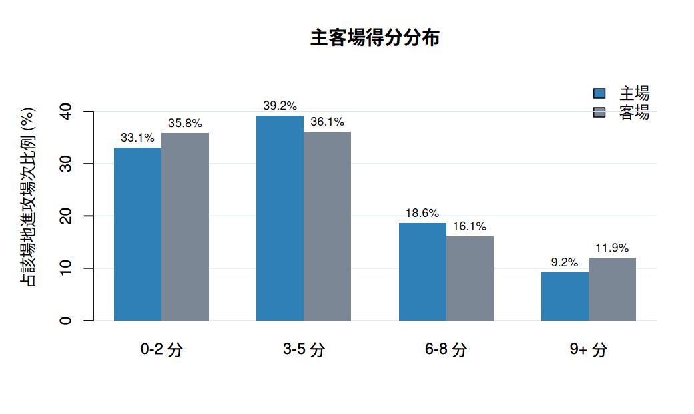

[](https://classroom.github.com/a/xfVbwuLD)

# CPBL Data Science

本專案以 CPBL 比賽資料為基礎，建立資料分析與預測結果展示網頁。網頁分為兩個主題：資料分析與預測結果。資料分析主題目前從主客場角度觀察勝負現象；預測結果主題整合互動式 CPBL state prediction prototype。

## Shiny App

專案網頁連結：[CPBL Data Science Shiny App](https://brianwangice.shinyapps.io/cpbl-data-science/)

## Contributors
|組員|系級|學號|工作分配|
|-|-|-|-|
|梁妤帆|資科碩一|114753221|團隊中的主題發想者+組長，負責資料清洗、整合資料欄位、海報與簡報製作|
|王炳翔|資科碩一|114753215|團隊中整合的成員，負責資料分析、製作預測模型、簡報製作| 
|陳柏宇|應數三|112701027|團隊中的資料分析師，負責資料分析、簡報製作| 
|蘇畇亦|心理三|112702005|團隊中的主題發想者+特徵分析師，負責製作特徵工程| 

## Quick start

在專案根目錄啟動 Shiny app：

```r
shiny::runApp()
```

或在終端機執行：

```bash
Rscript -e "shiny::runApp()"
```

重新產生目前主客場資料分析結果：

```bash
Rscript Scripts/Data_analysis/01_home_away_analysis.R
```

## Project Overview

目前 Shiny 網頁分成兩個主題：

- 資料分析：從主客場角度觀察 CPBL 勝負現象，並整理主客場勝率、平均得失分差、得分分布與小分差比賽勝率。
- 預測結果：整合 CPBL state prediction prototype，使用 `data/prediction/` 內的半局 result-state 預測、勝率橋接結果、打者類型 profile 與投手類型 profile。

## 資料分析概要

從 2024-2025 CPBL 賽季數據當中，從主客場角度觀察勝負現象會發現到，主場勝率高於客場，表示主場環境因素確實可能影響勝負。

<table>
  <tr>
    <td>
      
    </td>
    <td>
      
    </td>
  </tr>
</table>

不過，從圖表上顯示主場平均得分並沒有高於客場，反而略低於客場。這形成一個值得觀察的現象：主場優勢確實存在並且具有影響勝負的關鍵，但其中影響勝負的因素並不單純來自整體平均得分。

<table>
  <tr>
    <td>
      
    </td>
    <td>
      
    </td>
  </tr>
</table>

進一步拆解後可以發現，這個現象可能同時來自兩個方向。第一，主場在 1 分差比賽中的勝率為 59.2%，高於客場的 40.8%，表示主場較容易在小分差的關鍵比賽中把勝利收下。第二，客場 9+ 分場次比例為 11.9%，高於主場的 9.2%，表示客場平均得分略高可能受到少數高得分場次拉高。

因此，資料分析的結論：主場勝率較高並不是因為主場整體平均得分較高，而是主場較常拿下小分差比賽，因此後續以如何有效得知當下局勢為關鍵局去做分析。

## 預測模型

### 1. 模型構想

本專案以 Markov chain 作為預測模型的核心概念。

使用原因：

- 棒球每個打席都可以視為一次狀態轉移。
- 下一個局面主要受到當下壘包、出局數、比分差與攻守情境影響。
- Markov chain 具有「無記憶性」，適合用當下狀態推估下一步可能結果。

### 2. 預測模型框架

模型分成兩個階段。

```text
局內狀態轉移
  -> 預測半局 result state
  -> 對應不同 result state 的後續勝率
  -> 加權得到最終勝率
```

- 第一階段：預測目前半局會收斂到哪一種 result state。
- 第二階段：把 result state 對應到後續勝率，推估最終贏球機率。

### 3. 局內 State 轉移

局內 state 會依據當下打席情境轉移。

主要特徵：

- `current_base_out_state`：目前壘包與出局數狀態。
- `score_diff_before` / `score_diff_bucket`：打席前的比分差與比分區間。
- `run_expectancy_before`：當下局面的得分期望值。
- `inning` / `half_inning` / `home_away_context`：局數、上下半局與主客場進攻情境。
- `batter_primary_type` / `pitcher_primary_type`：打者與投手類型。

模型會將局內情境收斂成五種 result state：

- `no_score_stable`：安靜無得分。
- `wasted_chance`：攻勢浪費。
- `score_once`：單分進帳。
- `score_multiple`：多分進帳。
- `big_inning`：大局形成。

### 4. 局數間勝率推估

局數間的勝率推估會使用第一階段輸出的 result state 機率。

模型不只看「最可能發生的半局結果」，而是同時考慮五種 result state 的機率分布。

```text
最終勝率
= 各 result state 發生機率
  x 該 result state 對應的後續勝率
```

因此，模型可以把局內情境轉換成更直觀的勝率預測，用來判斷當下局勢對比賽結果的影響。

## Folder Organization


### `app.R`

Shiny app 進入點，負責整合資料載入、資料分析頁與預測結果頁。

### `R/`

Shiny app 的主要模組。

- `data_loader.R`：集中讀取 cleaned、analysis 與 prediction 資料。
- `ui_analysis.R`：資料分析頁 UI。
- `server_analysis.R`：資料分析頁 server 與圖表邏輯。
- `prediction_app.R`：預測結果頁 UI 與 server。

### `Scripts/`

資料處理與分析腳本。

- `Scripts/Data_analysis/01_home_away_analysis.R`：產生目前主客場分析使用的 CSV 與 README 圖表。

### `data/`

- `data/raw/`：保留原始資料。
- `data/cleaned/`：放資料分析與模型訓練後整理出的資料。
- `data/analysis/`：放資料分析腳本產生的摘要結果。
- `data/prediction/`：放 Shiny 預測結果頁需要讀取的模型輸出與球員 profile。

### `docs/`

專案文件與輸出圖表。

### `www/`

Shiny app 靜態資源，目前包含 `styles.css`。

## References

- Fu Jen Catholic University (2015). [Application of Machine Learning Models for Baseball Outcome Prediction](https://www.mdpi.com/2076-3417/15/13/7081) 
