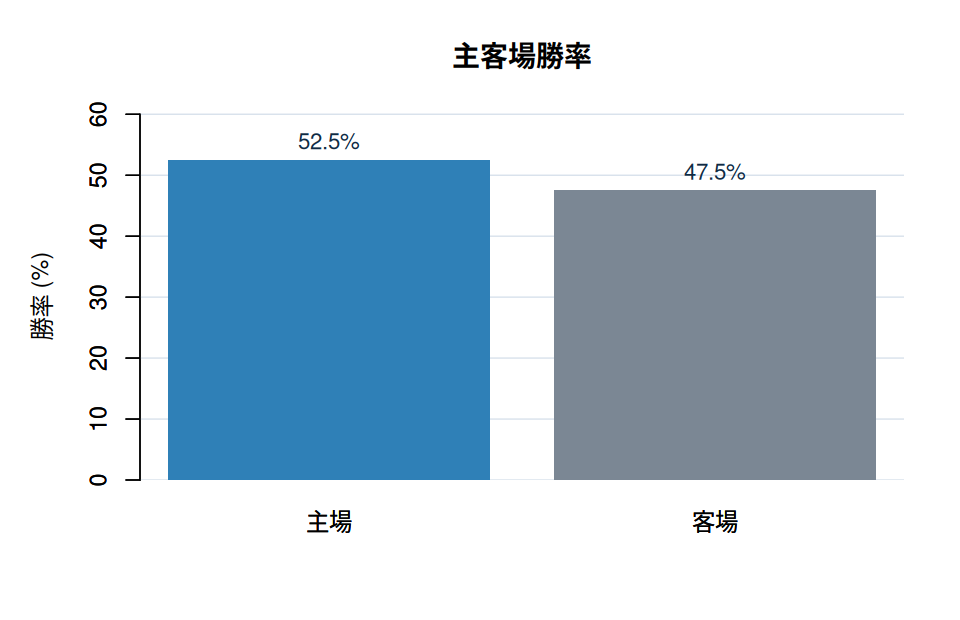
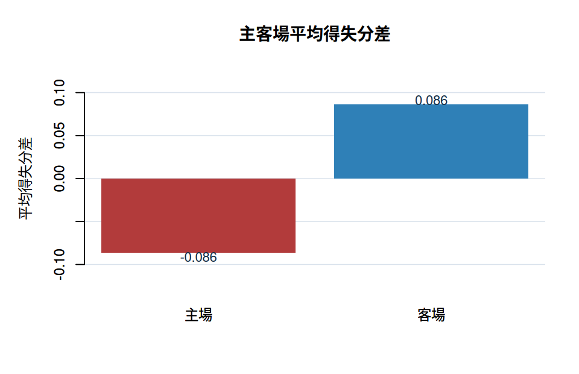

# CPBL Data Science

## 資料分析概要

從 2024-2025 CPBL賽季數據當中，從主客場角度觀察勝負現象會發現到，主場勝率高於客場，表示主場環境因素確實可能影響勝負。
<table>
  <tr>
    <td>
      
    </td>
    <td>
      
    </td>
  </tr>
</table>
不過，從圖表上顯示主場平均得分並沒有高於客場，反而略低於客場。形成一個值得觀察的現象：主場優勢確實存在並且具有影響勝負的關鍵，但其中影響勝負的因素並不單純來自得分。


## 專案結構

```text
app.R
R/
  data_loader.R
  ui_analysis.R
  server_analysis.R
  prediction_app.R
www/
  styles.css
data/
  raw/
  cleaned/
  prediction/
```

## 頁面主題

### 資料分析


### 預測結果

整合互動式 CPBL state prediction prototype，使用 `data/prediction/` 內的半局 result-state 預測、勝率橋接結果、打者類型 profile 與投手類型 profile。


## 執行方式

在專案根目錄啟動 Shiny app：

```r
shiny::runApp()
```

或在終端機執行：

```bash
Rscript -e "shiny::runApp()"
```

## 資料資料夾

`data/raw/` 保留原始資料。

`data/cleaned/` 放資料分析與模型訓練後整理出的資料。

`data/prediction/` 放 Shiny 預測結果頁需要讀取的模型輸出與球員 profile。
